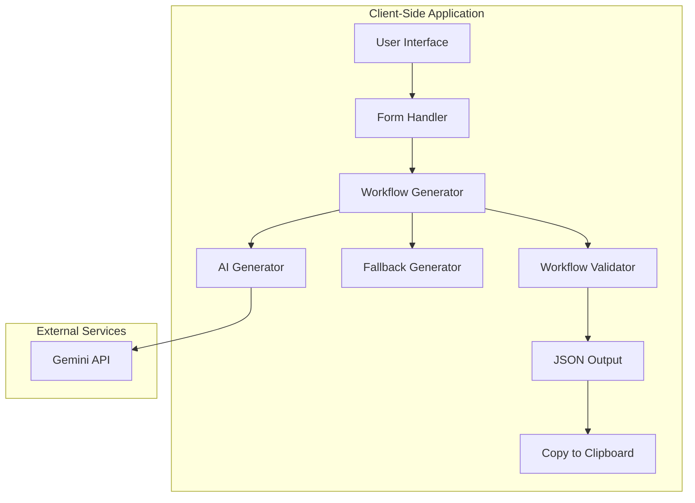
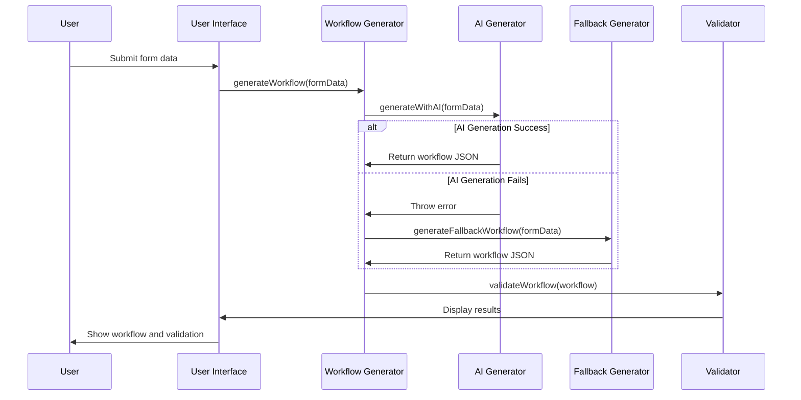

# Design Document

## Overview

The Perfect n8n Workflow Generator is a client-side web application that generates valid n8n workflow JSON configurations. The application uses a hybrid approach combining AI-powered generation (via Google's Gemini API) with a robust fallback system to ensure reliability. The design emphasizes user experience with a modern, responsive interface and real-time validation feedback.

## Architecture

### High-Level Architecture



### Component Architecture

The application follows a modular class-based architecture with clear separation of concerns:

1. **PerfectN8nGenerator Class**: Main orchestrator handling user interactions and workflow generation
2. **Form Management**: Handles user input collection and validation
3. **AI Generation Module**: Manages Gemini API integration with error handling
4. **Fallback Generation Module**: Provides reliable local workflow generation
5. **Validation Engine**: Ensures generated workflows meet n8n standards
6. **UI Controller**: Manages interface states and user feedback

## Components and Interfaces

### Core Components

#### 1. PerfectN8nGenerator Class

**Purpose**: Main application controller that orchestrates all workflow generation activities.

**Key Methods**:
- `constructor()`: Initializes API configuration and event listeners
- `generateWorkflow()`: Main workflow generation orchestrator
- `generateWithAI(formData)`: Handles AI-powered generation via Gemini API
- `generateFallbackWorkflow(formData)`: Creates workflows using local logic
- `validateWorkflow(workflow)`: Validates generated JSON against n8n schema

**Configuration**:
```javascript
{
  GEMINI_API_KEY: 'API_KEY',
  GEMINI_API_URL: 'https://generativelanguage.googleapis.com/v1beta/models/gemini-1.5-pro-latest:generateContent'
}
```

#### 2. Form Data Interface

**Structure**:
```javascript
{
  description: string,    // User's workflow description
  triggerType: string,    // 'webhook' | 'schedule' | 'manual'
  complexity: string      // 'simple' | 'medium' | 'complex'
}
```

#### 3. n8n Workflow Schema

**Core Structure**:
```javascript
{
  name: string,
  nodes: Array<Node>,
  connections: Object,
  active: boolean,
  settings: Object,
  tags: Array<string>
}
```

**Node Structure**:
```javascript
{
  parameters: Object,
  id: string,
  name: string,
  type: string,
  typeVersion: number,
  position: [number, number]
}
```

### Supported n8n Node Types

The system supports the following current, valid n8n node types with proper parameters:

**Trigger Nodes:**
- `n8n-nodes-base.webhook`: HTTP webhook triggers with proper HTTP methods and authentication
- `n8n-nodes-base.scheduleTrigger`: Time-based triggers with valid cron expressions or intervals
- `n8n-nodes-base.manualTrigger`: Manual execution triggers
- `n8n-nodes-base.rssFeedRead`: RSS feed reading with actual RSS URLs (not example.com)

**Processing Nodes:**
- `n8n-nodes-base.httpRequest`: HTTP requests with proper authentication, headers, and error handling
- `n8n-nodes-base.code`: JavaScript code execution with proper data flow syntax
- `n8n-nodes-base.set`: Data manipulation with correct field mapping
- `n8n-nodes-base.if`: Conditional logic with proper expression syntax

**Integration Nodes:**
- `n8n-nodes-base.openAi`: AI content generation with model selection and API key configuration
- `n8n-nodes-base.slack`: Slack integration with proper authentication parameters
- `n8n-nodes-base.gmail`: Gmail integration with OAuth configuration
- `n8n-nodes-base.twitter`: Twitter integration with proper API credentials
- `n8n-nodes-base.respondToWebhook`: Webhook responses with proper status codes and headers

**Data Flow Requirements:**
- Use `{{ $json.fieldName }}` syntax for accessing previous node data
- Ensure proper data passing between nodes
- Include error handling paths where needed
- Validate that each node receives required data from previous nodes

## Data Models

### Workflow Generation Flow



### Node Creation Patterns

#### Trigger Node Factory
```javascript
createTriggerNode(triggerType, id, x) {
  const configs = {
    webhook: { 
      type: 'n8n-nodes-base.webhook', 
      typeVersion: 1,
      parameters: {
        httpMethod: 'POST',
        path: 'webhook-path',
        responseMode: 'onReceived',
        authentication: 'none'
      }
    },
    schedule: { 
      type: 'n8n-nodes-base.scheduleTrigger', 
      typeVersion: 1,
      parameters: {
        rule: {
          interval: [{
            field: 'cronExpression',
            expression: '0 9 * * 1-5' // Valid cron expression
          }]
        }
      }
    },
    manual: { 
      type: 'n8n-nodes-base.manualTrigger', 
      typeVersion: 1,
      parameters: {}
    }
  };
  return buildNode(configs[triggerType], id, x);
}
```

#### Processing Node Factory with Proper Data Flow
```javascript
createProcessingNode(id, x, previousNodeName) {
  return {
    type: 'n8n-nodes-base.code',
    typeVersion: 2,
    parameters: { 
      jsCode: `
        // Access previous node data using correct syntax
        const inputData = $input.all();
        const processedData = inputData.map(item => ({
          ...item.json,
          processed: true,
          timestamp: new Date().toISOString()
        }));
        return processedData;
      `
    },
    id: id,
    name: \`Process Data \${id}\`,
    position: [x, 300]
  };
}
```

#### HTTP Request Node Factory with Authentication
```javascript
createHttpRequestNode(id, x, url, method = 'GET') {
  return {
    type: 'n8n-nodes-base.httpRequest',
    typeVersion: 4,
    parameters: {
      url: url,
      method: method,
      authentication: 'predefinedCredentialType',
      nodeCredentialType: 'httpBasicAuth',
      sendHeaders: true,
      headerParameters: {
        parameters: [
          {
            name: 'Content-Type',
            value: 'application/json'
          }
        ]
      },
      options: {
        timeout: 10000,
        retry: {
          enabled: true,
          maxRetries: 3
        }
      }
    },
    id: id,
    name: \`HTTP Request \${id}\`,
    position: [x, 300]
  };
}
```

## Error Handling

### Error Handling Strategy

1. **API Failures**: Graceful fallback to local generation
2. **Network Issues**: User-friendly error messages with retry suggestions
3. **Validation Errors**: Detailed feedback on JSON structure issues
4. **Rate Limiting**: Automatic fallback with user notification

### Error Types and Responses

```javascript
const errorHandling = {
  'API_UNAVAILABLE': () => this.generateFallbackWorkflow(formData),
  'INVALID_JSON': (error) => this.showValidationError(error),
  'NETWORK_ERROR': () => this.showRetryOption(),
  'RATE_LIMITED': () => this.showFallbackNotification()
};
```

## Testing Strategy

### Unit Testing Approach

1. **Component Testing**:
   - Form data collection and validation
   - Node creation functions
   - Workflow structure generation
   - JSON validation logic

2. **Integration Testing**:
   - AI API integration with mock responses
   - Fallback generation scenarios
   - End-to-end workflow generation

3. **Validation Testing**:
   - n8n schema compliance
   - Node connection integrity
   - Parameter completeness

### Test Scenarios

#### Core Functionality Tests
- Generate simple webhook workflow
- Generate scheduled workflow with medium complexity
- Generate complex manual workflow with integrations
- Validate AI generation with various prompts
- Test fallback generation for all complexity levels

#### Error Handling Tests
- API failure scenarios
- Invalid JSON responses from AI
- Network connectivity issues
- Malformed user input handling

#### UI/UX Tests
- Form validation and user feedback
- Loading states and progress indicators
- Copy-to-clipboard functionality
- Responsive design on different screen sizes

### Performance Considerations

1. **Client-Side Processing**: All generation happens in the browser for privacy and speed
2. **API Optimization**: Structured prompts to minimize token usage while maximizing workflow quality
3. **Fallback Efficiency**: Pre-defined templates for quick local generation of complex automations
4. **Memory Management**: Efficient JSON handling for large workflows with multiple integrations
5. **Template Caching**: Cache frequently used automation patterns for faster generation
6. **Progressive Enhancement**: Load advanced features only when needed

### Security Considerations

1. **API Key Management**: Client-side API key (acceptable for demo/personal use)
2. **Input Sanitization**: Validate and sanitize user descriptions
3. **XSS Prevention**: Proper HTML escaping for dynamic content
4. **CORS Handling**: Proper API request configuration

### Comprehensive Accuracy and Validation Framework

#### Official Node Type Registry
```javascript
const OFFICIAL_NODE_TYPES = {
  // Trigger Nodes
  'n8n-nodes-base.webhook': { 
    currentTypeVersion: 2, 
    supportedVersions: [1, 2],
    requiredParams: ['httpMethod', 'path'],
    optionalParams: ['responseMode', 'authentication', 'options']
  },
  'n8n-nodes-base.scheduleTrigger': { 
    currentTypeVersion: 1, 
    supportedVersions: [1],
    requiredParams: ['rule'],
    optionalParams: ['timezone']
  },
  'n8n-nodes-base.manualTrigger': { 
    currentTypeVersion: 1, 
    supportedVersions: [1],
    requiredParams: [],
    optionalParams: []
  },
  'n8n-nodes-base.rssFeedRead': { 
    currentTypeVersion: 1, 
    supportedVersions: [1],
    requiredParams: ['url'],
    optionalParams: ['pollTimes', 'feedReadMode']
  },
  
  // Processing Nodes
  'n8n-nodes-base.httpRequest': { 
    currentTypeVersion: 4, 
    supportedVersions: [1, 2, 3, 4],
    requiredParams: ['url', 'method'],
    optionalParams: ['authentication', 'sendHeaders', 'sendQuery', 'sendBody', 'options']
  },
  'n8n-nodes-base.code': { 
    currentTypeVersion: 2, 
    supportedVersions: [1, 2],
    requiredParams: ['jsCode'],
    optionalParams: ['mode']
  },
  'n8n-nodes-base.set': { 
    currentTypeVersion: 3, 
    supportedVersions: [1, 2, 3],
    requiredParams: ['values'],
    optionalParams: ['options']
  },
  'n8n-nodes-base.if': { 
    currentTypeVersion: 2, 
    supportedVersions: [1, 2],
    requiredParams: ['conditions'],
    optionalParams: ['combineOperation']
  },
  
  // Integration Nodes
  'n8n-nodes-base.openAi': { 
    currentTypeVersion: 1, 
    supportedVersions: [1],
    requiredParams: ['resource', 'operation'],
    optionalParams: ['model', 'prompt', 'maxTokens', 'temperature']
  },
  'n8n-nodes-base.slack': { 
    currentTypeVersion: 2, 
    supportedVersions: [1, 2],
    requiredParams: ['resource', 'operation'],
    optionalParams: ['channel', 'text', 'attachments']
  },
  'n8n-nodes-base.twitter': { 
    currentTypeVersion: 2, 
    supportedVersions: [1, 2],
    requiredParams: ['resource', 'operation'],
    optionalParams: ['text', 'additionalFields']
  },
  'n8n-nodes-base.gmail': { 
    currentTypeVersion: 2, 
    supportedVersions: [1, 2],
    requiredParams: ['resource', 'operation'],
    optionalParams: ['subject', 'message', 'toList']
  },
  'n8n-nodes-base.respondToWebhook': { 
    currentTypeVersion: 1, 
    supportedVersions: [1],
    requiredParams: [],
    optionalParams: ['respondWith', 'responseBody', 'responseHeaders', 'responseStatusCode']
  }
};

// Strict validation function
validateNodeAccuracy(nodeType, typeVersion, parameters) {
  const nodeSpec = OFFICIAL_NODE_TYPES[nodeType];
  
  if (!nodeSpec) {
    return {
      isValid: false,
      error: `Invalid node type: ${nodeType}. Only official n8n-nodes-base.* nodes are allowed.`
    };
  }
  
  if (!nodeSpec.supportedVersions.includes(typeVersion)) {
    return {
      isValid: false,
      error: `Invalid typeVersion ${typeVersion} for ${nodeType}. Supported versions: ${nodeSpec.supportedVersions.join(', ')}`
    };
  }
  
  // Check required parameters
  const missingParams = nodeSpec.requiredParams.filter(param => !parameters.hasOwnProperty(param));
  if (missingParams.length > 0) {
    return {
      isValid: false,
      error: `Missing required parameters for ${nodeType}: ${missingParams.join(', ')}`
    };
  }
  
  return { isValid: true };
}
```

#### Data Flow Expression Validation
```javascript
const DATA_FLOW_PATTERNS = {
  // Valid n8n expression patterns
  VALID_EXPRESSIONS: [
    /\{\{\s*\$json\["[\w\-\.]+"\]\s*\}\}/,  // {{ $json["fieldName"] }}
    /\{\{\s*\$json\.[\w\-\.]+\s*\}\}/,      // {{ $json.fieldName }}
    /\{\{\s*\$node\["[\w\s\-\.]+"\]\.json\["[\w\-\.]+"\]\s*\}\}/, // {{ $node["Node Name"].json["field"] }}
    /\{\{\s*\$input\.all\(\)\s*\}\}/,       // {{ $input.all() }}
    /\{\{\s*\$input\.first\(\)\s*\}\}/      // {{ $input.first() }}
  ],
  
  // Invalid patterns to avoid
  INVALID_PATTERNS: [
    /\{\{\s*data\./,                        // Avoid generic "data." references
    /\{\{\s*item\./,                        // Avoid generic "item." references
    /\{\{\s*response\./                     // Avoid generic "response." references
  ]
};

validateDataFlowExpression(expression) {
  const isValid = DATA_FLOW_PATTERNS.VALID_EXPRESSIONS.some(pattern => 
    pattern.test(expression)
  );
  
  const hasInvalidPattern = DATA_FLOW_PATTERNS.INVALID_PATTERNS.some(pattern => 
    pattern.test(expression)
  );
  
  if (hasInvalidPattern) {
    return {
      isValid: false,
      error: `Invalid data flow expression: ${expression}. Use proper n8n syntax like {{ $json["fieldName"] }}`
    };
  }
  
  return { isValid };
}
```

#### Connection Logic Validation
```javascript
validateWorkflowConnections(workflow) {
  const { nodes, connections } = workflow;
  const errors = [];
  const warnings = [];
  
  // Ensure logical flow
  nodes.forEach(node => {
    if (node.type !== 'n8n-nodes-base.manualTrigger' && 
        node.type !== 'n8n-nodes-base.webhook' && 
        node.type !== 'n8n-nodes-base.scheduleTrigger' &&
        node.type !== 'n8n-nodes-base.rssFeedRead') {
      
      // Non-trigger nodes must have input connections
      const hasInput = Object.values(connections).some(nodeConnections => 
        nodeConnections.main && nodeConnections.main.some(connection => 
          connection.some(conn => conn.node === node.name)
        )
      );
      
      if (!hasInput) {
        errors.push(`Node "${node.name}" has no input connection`);
      }
    }
  });
  
  // Validate connection targets exist
  Object.entries(connections).forEach(([sourceName, nodeConnections]) => {
    if (nodeConnections.main) {
      nodeConnections.main.forEach(connectionGroup => {
        connectionGroup.forEach(connection => {
          const targetExists = nodes.some(node => node.name === connection.node);
          if (!targetExists) {
            errors.push(`Connection references non-existent node: ${connection.node}`);
          }
        });
      });
    }
  });
  
  return { isValid: errors.length === 0, errors, warnings };
}
```

#### URL and Credential Validation
```javascript
const VALIDATION_RULES = {
  // Prohibited placeholder URLs
  INVALID_URLS: [
    'example.com',
    'placeholder.com',
    'your-api-endpoint.com',
    'https://example.com',
    'http://example.com'
  ],
  
  // Valid URL patterns for different services
  VALID_URL_PATTERNS: {
    rss: /^https?:\/\/.+\.(xml|rss)(\?.*)?$/i,
    api: /^https?:\/\/[a-zA-Z0-9\-\.]+\.[a-zA-Z]{2,}(\/.*)?$/,
    webhook: /^https?:\/\/[a-zA-Z0-9\-\.]+\.[a-zA-Z]{2,}(\/.*)?$/
  },
  
  // Credential naming patterns
  CREDENTIAL_PATTERNS: {
    oauth2: /^[a-zA-Z0-9\-_]+OAuth2?$/i,
    apiKey: /^[a-zA-Z0-9\-_]+ApiKey$/i,
    basic: /^[a-zA-Z0-9\-_]+BasicAuth$/i
  }
};

validateUrlAndCredentials(node) {
  const errors = [];
  
  // Check for placeholder URLs
  if (node.parameters.url) {
    const url = node.parameters.url.toLowerCase();
    if (VALIDATION_RULES.INVALID_URLS.some(invalid => url.includes(invalid))) {
      errors.push(`Node "${node.name}" uses placeholder URL. Provide actual endpoint or mark as placeholder.`);
    }
  }
  
  // Validate RSS URLs specifically
  if (node.type === 'n8n-nodes-base.rssFeedRead' && node.parameters.url) {
    if (!VALIDATION_RULES.VALID_URL_PATTERNS.rss.test(node.parameters.url)) {
      errors.push(`RSS Feed node "${node.name}" requires valid RSS/XML URL`);
    }
  }
  
  // Check credential references
  if (node.parameters.authentication && node.parameters.authentication !== 'none') {
    if (node.credentials && Object.keys(node.credentials).length === 0) {
      errors.push(`Node "${node.name}" requires authentication but no credentials specified`);
    }
  }
  
  return errors;
}
```

#### Comprehensive Workflow Validation Engine
```javascript
class WorkflowAccuracyValidator {
  validateComplete(workflow) {
    const results = {
      isValid: true,
      errors: [],
      warnings: [],
      nodeValidation: {},
      connectionValidation: {},
      dataFlowValidation: {}
    };
    
    // 1. Validate each node for accuracy
    workflow.nodes.forEach(node => {
      const nodeResult = this.validateNodeComplete(node);
      results.nodeValidation[node.name] = nodeResult;
      
      if (!nodeResult.isValid) {
        results.isValid = false;
        results.errors.push(...nodeResult.errors);
      }
    });
    
    // 2. Validate connections
    const connectionResult = validateWorkflowConnections(workflow);
    results.connectionValidation = connectionResult;
    
    if (!connectionResult.isValid) {
      results.isValid = false;
      results.errors.push(...connectionResult.errors);
    }
    
    // 3. Validate data flow expressions
    const dataFlowResult = this.validateAllDataFlowExpressions(workflow);
    results.dataFlowValidation = dataFlowResult;
    
    if (!dataFlowResult.isValid) {
      results.isValid = false;
      results.errors.push(...dataFlowResult.errors);
    }
    
    return results;
  }
  
  validateNodeComplete(node) {
    const errors = [];
    
    // Node type and version validation
    const accuracyResult = validateNodeAccuracy(node.type, node.typeVersion, node.parameters);
    if (!accuracyResult.isValid) {
      errors.push(accuracyResult.error);
    }
    
    // URL and credential validation
    const urlErrors = validateUrlAndCredentials(node);
    errors.push(...urlErrors);
    
    // Parameter completeness validation
    const paramErrors = this.validateParameterCompleteness(node);
    errors.push(...paramErrors);
    
    return {
      isValid: errors.length === 0,
      errors
    };
  }
  
  validateParameterCompleteness(node) {
    const errors = [];
    const nodeSpec = OFFICIAL_NODE_TYPES[node.type];
    
    if (!nodeSpec) return errors;
    
    // Check for specific parameter requirements based on node type
    switch (node.type) {
      case 'n8n-nodes-base.scheduleTrigger':
        if (!node.parameters.rule || !node.parameters.rule.interval) {
          errors.push(`Schedule trigger "${node.name}" missing valid cron expression or interval`);
        }
        break;
        
      case 'n8n-nodes-base.httpRequest':
        if (!node.parameters.authentication || node.parameters.authentication === 'none') {
          // Warning for HTTP requests without authentication
          errors.push(`HTTP Request "${node.name}" has no authentication configured`);
        }
        break;
        
      case 'n8n-nodes-base.openAi':
        if (!node.parameters.model) {
          errors.push(`OpenAI node "${node.name}" missing model specification`);
        }
        break;
    }
    
    return errors;
  }
}
```

### Metadata and Naming Convention System

#### Consistent Naming Strategy
```javascript
class WorkflowNamingSystem {
  generateWorkflowName(description, triggerType) {
    // Extract key action words and create descriptive name
    const actionWords = this.extractActionWords(description);
    const triggerPrefix = this.getTriggerPrefix(triggerType);
    
    return `${triggerPrefix} ${actionWords.join(' ')} Automation`;
  }
  
  generateNodeName(nodeType, index, purpose) {
    const nodeTypeMap = {
      'n8n-nodes-base.webhook': 'Webhook Trigger',
      'n8n-nodes-base.scheduleTrigger': 'Schedule Trigger',
      'n8n-nodes-base.httpRequest': 'HTTP Request',
      'n8n-nodes-base.code': 'Process Data',
      'n8n-nodes-base.set': 'Set Values',
      'n8n-nodes-base.if': 'Conditional Check',
      'n8n-nodes-base.openAi': 'AI Generation',
      'n8n-nodes-base.slack': 'Slack Notification'
    };
    
    const baseName = nodeTypeMap[nodeType] || 'Node';
    return purpose ? `${baseName} - ${purpose}` : `${baseName} ${index}`;
  }
}
```

#### Comprehensive Metadata Generation
```javascript
generateWorkflowMetadata(description, complexity, triggerType) {
  return {
    name: this.namingSystem.generateWorkflowName(description, triggerType),
    active: false, // Start inactive for safety
    settings: {
      executionOrder: 'v1',
      saveManualExecutions: true,
      callerPolicy: 'workflowsFromSameOwner',
      errorWorkflow: '',
      timezone: 'America/New_York'
    },
    tags: [
      'auto-generated',
      `complexity-${complexity}`,
      `trigger-${triggerType}`,
      'kiro-generated',
      new Date().toISOString().split('T')[0] // Date tag
    ],
    meta: {
      generatedBy: 'Perfect n8n Workflow Generator',
      generatedAt: new Date().toISOString(),
      version: '1.0.0',
      description: description,
      complexity: complexity,
      triggerType: triggerType,
      nodeCount: 0, // Will be updated after generation
      lastModified: new Date().toISOString()
    },
    versionId: this.generateVersionId()
  };
}
```

#### Documentation and Comments System
```javascript
addNodeDocumentation(node, purpose, dataFlow) {
  return {
    ...node,
    notes: `
Purpose: ${purpose}
Generated: ${new Date().toISOString()}
Data Flow: ${dataFlow}
Validation: Auto-validated for n8n compatibility
    `.trim(),
    webhookId: node.type === 'n8n-nodes-base.webhook' ? this.generateWebhookId() : undefined
  };
}
```

### Scalability Design

1. **Modular Architecture**: Easy to add new node types and complexity levels with strict validation
2. **Template System**: Extensible node creation patterns with business automation focus and accuracy enforcement
3. **Configuration-Driven**: Easy to modify supported node types and parameters through OFFICIAL_NODE_TYPES registry
4. **Plugin Architecture**: Potential for extending with custom node generators while maintaining accuracy standards
5. **Template Library**: Expandable collection of pre-built automation scenarios with validated configurations
6. **AI Prompt Evolution**: Continuously improvable prompts for better workflow generation with accuracy constraints
7. **Enterprise Integration**: Designed for scaling to handle complex business automations with production-ready validation
8. **Accuracy Framework**: Comprehensive validation system that scales with new n8n releases and node updates
9. **Metadata System**: Consistent naming and documentation that improves maintainability at scale